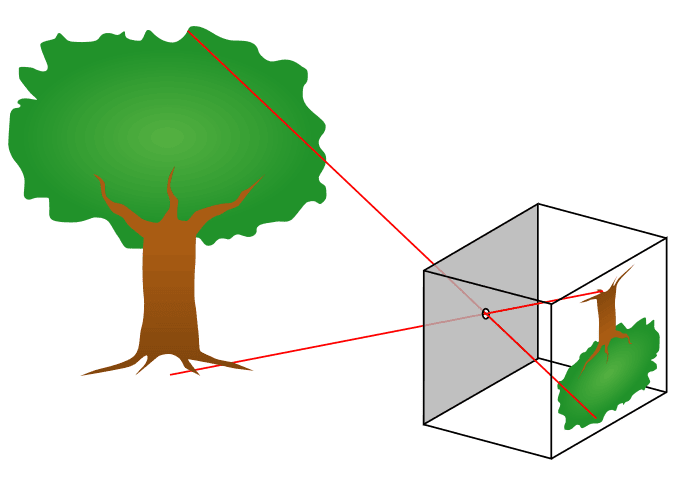
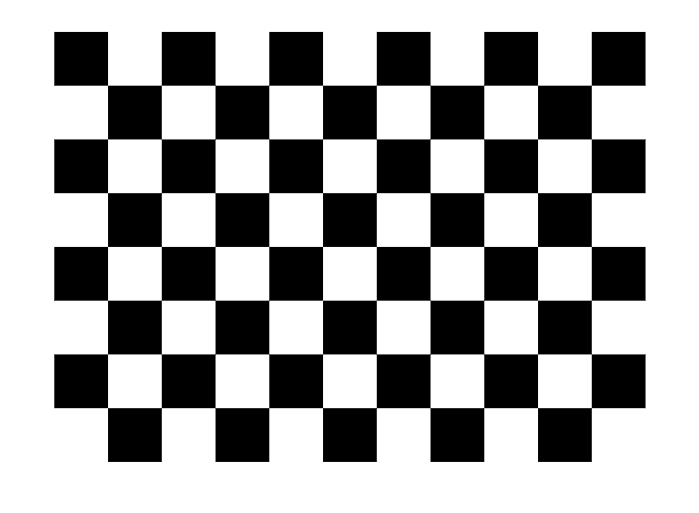
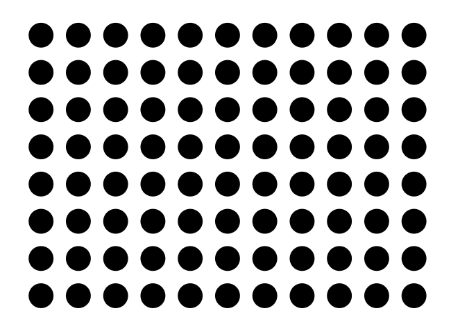
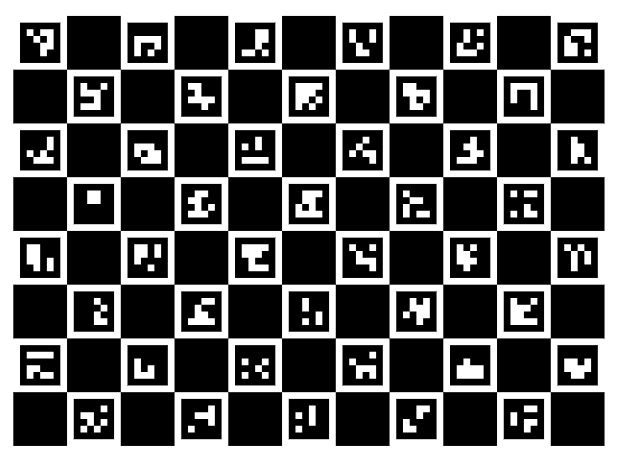

# Cameras and Calibration

## Getting Setup

This section will work from it's own workspace seperate from the core training exercises.

1. Create the workspace and copy the template packages.

    ```
    mkdir ~/calibration_ws/src -p
    cp -r ~/industrial_training/exercises/9.0/template/* ~/calibration_ws/src
    ```

1. Clone necessary repositories from github

    ```
    cd ~/calibration_ws/src
    vcs import < dependencies.repos
    ```

1. Install apt dependencies

    ```
    rosdep install --from-paths . -iyr
    ```

1. Source and build the workspace

    ```
    source /opt/ros/humble/setup.bash
    cd ~/calibration_ws/
    colcon build
    ```

## Camera Representation and Parameters

The typical model used to represent cameras is a so-called "Pinhole model." 



The idea is that light is completely focused through a single point and then projected into our image. When working with this model, there are 3 key factors:

1. Focal length, or the distance between the focal point and our optics (Fx, Fy)

    - Affects our Field of View (FoV). A smaller focal length will widen the FoV while a larger focal length will narrow it

2. Principal point location (Cx, Cy)

    - Effectively measures how "offset" the pinhole is. It it not required to be right in the center

3. Distortion Parameters (D, or usually 5+ parameters)

    - Describe how the lens is distorting incoming images. Images end up more warped on the outer edges compared to the center, and models exist to counteract that. The goal is to have straight lines in real life be straight in your images.

We need accurate F, C, and D values to be able to extend reasoning from our images to the real world. Without these, you have no information on how your images are scaled, shifted, and warped compared to the real world.

## Calibration Targets

Camera calibration relies on predictably shaped and easy to localize calibration targets. Knowing the targets to identify in calibration images along with their spacing allows the optimization to reason about how the targets exist in space.





Popular targets include checkerboard patterns, Aruco markers, Charuco markers, and circle grids, with potential modifications on those few. Checkerboard patterns are simple and easy to use. Circles are easy to spot, but lack some precision in determining exactly what point defines the center. Using Aruco/Charuco markers has the advantage of being able to easily and uniquely identify the various points on the grid - such that you don't need to find every marker to get information on the board's pose. So a marker based target is generally advised if possible, and a specially printed and solid target is especially desirable. (see [here](https://calib.io/pages/camera-calibration-pattern-generator))

Every little detail counts, and very small details can throw off image processing results if the calibration isn't quite right.

## Intrinsic Calibration

The way we get those parameters is called "Intrinsic Calibration," since those parameters are "intrinsic" to the camera, regardless of where it ends up being placed. There are a number of camera calibration tools available to do this calibration, but if you're already working in ROS, one of the easier options is the `camera_calibration` package. 

1. To start, we can simply apt install the package

    ```
    sudo apt install ros-humble-camera-calibration
    ```

1. The next thing we need is data for the calibration to be run on. Normally, you would be able to use a live camera feed for the intrinsic calibration, but to make this training more universally accessible and repeatable, we will be working from bag files.

    Create and copy over the bag files (running the python script will take some time to complete).

    ```
    source /opt/ros/humble/setup.bash
    cd ~/industrial_training/exercises/9.0
    python3 images_to_bag.py
    cp -r ./intrinsics_rosbag* ~/calibration_ws
    ```

1. Get 2 terminals ready.

    In the first one, run the first rosbag file on loop.

    ```
    ros2 bag play -l ~/calibration_ws/intrinsics_rosbag0
    ```

    In the second terminal, run the camera calibration node

    ```
    ros2 run camera_calibration cameracalibrator --size 7x10 --square 0.014 --no-service-check --camera camera0 --ros-args -r image:=/camera/image_raw -p camera:=/camera0
    ```

1. You should see a pop-up. Wait for the bag to play out - eventually the meters on the right side will stop improving, and you should click "Calibrate".

    

    Once the calibration is done, you should see a printout of the calibration parameters. Furthermore, the application is now applying the calibration to undistort (rectify) the incoming images in the pop-up window. You may be able to notice that the straight edges of the checkerboard are now straighter.

    To record these parameters down, click save.

    It will save to `/tmp/calibrationdata.tar.gz`. 

1. Let's get the files somewhere we can easily reach them

    ```
    mkdir ~/calibration_ws/src/camera0_cal
    mv /tmp/calibrationdata.tar.gz ~/calibration_ws/src/camera0_cal
    cd ~/calibration_ws/src/camera0_cal
    tar -xvf calibrationdata.tar.gz
    ```

    This records all the original images used for the calibration, as well as the calibration parameters in two files: `ost.txt` and `ost.yaml`. Different applications expect intrinsics in a number of different ways, so you'll likely have to place particular parameters from these files in a certain structure.

1. Repeat the above process to get a calibration for `camera1` via `intrinsic_rosbag1`

### Playing with the dummy data

Try repeating the calibration, but vary the amount of data you let it have before you run the calibration. Try to get a feel for how many images you need before the diminishing returns are too weak, using the values received for using all images as a baseline.

### Performing with your own data

This is a note to be weary, because even "good" looking calibrations may be lacking. 

Notice that there were still distortions once the calibration was applied in our earlier example. This is in part because the data collection did not place the target across the entire image space of the camera. The `camera_calibration` GUI was even indicating to us that our `x` component was not adequately covered in our data - a visual insepection of the images coming from the bag file should confirm this.

All of this is to say: _get full coverage of your camera._ You want to go along all the outer edges with your pattern, especially because that's where the distortions are most notable. 

If you can, repeat the process using your own camera with you moving it around through space. It will give you a feel for how different things (brightness, angle, distance) effect the calibration software capturing your grid or not, and will set you up to repeat the process in the future as necessary.

Where there's a camera - there's a calibration.

## Using the intrinsic calibration

Now that we have the intrinsic calibration parameters, how do we use them? Your camera ROS driver is still just outputting the distorted image, so we need to include a tool to apply the parameters and undistort them. 

1. First, lets make sure we can find the calibration files by installing them into our package. Get each of your calibration folders into a new folder within our the template package: `cal_demo_intrinsics/config`, named `camera0_cal` and `camera1_cal` respectively.

    Don't forget to add an install rule in our `CMakeLists.txt` and to rebuild so that the files are discoverable.

1. The standard way to give ROS nodes access to these intrinsic parameters is through a `CameraInfo` message published alongside the image in the same namespace. For these examples, our images are coming in on `/camera/image_raw`, so we want to publish to `/camera/camera_info`. We can use the `camera_calibration_parsers` package to make things easier.

    Edit `cal_demo_intrinsics/src/camera_info_publisher.cpp` to allow it to parse the calibration file. 
    
    Some documentation references: [CameraInfo message](https://docs.ros.org/en/noetic/api/sensor_msgs/html/msg/CameraInfo.html), [Image message](https://docs.ros.org/en/noetic/api/sensor_msgs/html/msg/Image.html), [camera_calibration_parsers](https://docs.ros.org/en/api/camera_calibration_parsers/html/).
    
    Look for the sections marked `CODE HERE!`.

1. `colcon build` and startup your camera info publisher once it's complete.

    ```
    ros2 run cal_demo_intrinsics camera_info_publisher
    ```

1. Once we are publishing the camera info, other ROS nodes know what to do with it. The `image_proc` package is an easy way to put in your raw image and a CameraInfo msg to get out a rectified image. Startup a rosbag, and then run the following:

    ```
    ros2 run image_proc image_proc --ros-args -r image:=/camera/image_raw -r image_rect:=/camera/image_rect -r camera_info:=/camera/camera_info
    ```

1. Now open a window in Rviz and add two image plugins: `/camera/image_raw` and `/camera/image_rect`. 

    Pause the rosbag at any time by pressing space in its terminal, and examine the difference. The `/camera/image_rect` should have removed the distortions from the original image, giving us straight lines on our checkerboard. From here, we could use that rectified image being produced to do whatever our image processing is.

## Extrinsic Calibration

Once we have the intrinsic calibration of a camera, that is good to go for as long as the camera doesn't severely degrade. But while a camera will only need one _intrinsic_ calibration, it may need multiple _extrinsic_ calibrations over the course of its use. An extrinsic calibration is simply determining where the camera is in 3D space, relative to whatever components it is attached to. If you ever move the camera, you'll need to perform another extrinsic calibration. 

In order to do an extrinsic calibration, you need an a camera with an intrinsic calibration, and a camera target along with something that moves with you getting its precise transforms. Either the camera or the target needs to be attached to the moving item (hand-eye vs eye-in-hand), and the goal is to capture image/pose pairs. The collected data will be corresponding images and poses that occured at the same time for the optimization to perform its work.

### robot_cal_tools calibration

There are lots of tools out there currently, but lots of issues. MoveIt is currently still ROS 1, with a ROS 2 port in progress but not ready yet. The `industrial_calibration` is a good ROS agnostic library with lots of functionality, but requires considerable setup, so it can be hard to spin up quickly. On the other hand, `robot_cal_tools` offers a ROS-y way of performing the calibration, so the barrier to entry isn't quite as high.

1. Most of the setup has been done for you, but since extrinsic calibration needs poses, we are launching a simulation of the robot moving through space with our image data.

    ```
    ros2 launch cal_demo_motion motion_server.launch.py
    ```

1. We then need to turn on our client to step through the images and poses.

    ```
    ros2 run cal_demo_motion motion_client.py
    ```

1. We then need to launch the data collection node.

    ```
    ros2 launch rct_ros_tools_rclcpp command_line_data_collection.launch.xml target_file:=src/cal_demo_support/config/cal_target.yaml image_topic:=/camera/image_raw base_frame:=base_link tool_frame:=tool0
    ```

1. Step through the motion client window, making sure to trigger a data point collection before moving to each new position.

    ```
    ros2 service call /collect std_srvs/srv/Trigger {}
    ```

1. Once you have exhausted all of the images, save them

    ```
    ros2 service call /save std_srvs/srv/Trigger {}
    ```

1. You now have the images recorded alongside the transforms when they were captured. 

    Kill the data collection terminal and run the calibration.

    ```
    ros2 launch rct_ros_tools_rclcpp hand_eye_calibration.launch.xml data_path:=/tmp/calibration_data/data.yaml target_file:=src/cal_demo_support/config/cal_target.yaml homography_threshold:=2.0 intrinsics:=src/cal_demo_support/config/intrinsics.yaml output_file:=extrinsics.yaml target_frame:=target camera_frame:=camera camera_mount_frame:=base_link target_mount_frame:=tool0
    ```

    This will show you the reprojections of the points and save to the file extrinsics.yaml.

1. You should have noticed that the reprojections are wildly off, even though the finding of the corners was always accurate (even if some are missed). Why is this?

    This tool assumes a eye-in-hand calibration, so the poses we collected associated with each link was actually the inverse of what we wanted! We actually need switch our tool and base frame! Again, just a word of caution of how easy it can be to misconfigure these packages, and to be very aware of what they are actually asking for and expecting.

    Go back to the motion client step and redo the process. But during data collection change the link parameters to `base_frame:=tool0` and `tool_frame:=base_link`.

1. We finally have our extrinsic calibration! 

    Go ahead and use the results to fill in the transforms in `cal_demo_support/urdf/workcell.xacro`. There are joints `tool_to_target` and `base_to_camera` that should be updated on the new calibration.

    _Challenge_: If you have good knowledge of launch files and xacros, consider putting things together such that the extrinsic calibration is loaded on runtime, rather than hardcoded. This can be useful in a real environment if the camera has to move reasonably frequently.

1. Rerun the motion client to step through the images and motions, but open up a _camera_ plugin in Rviz to see the images. You should see the simulated robot align with the actual images taken at each pose.

Congrats! You can now use camera calibrations to reason about sensed objects in world space!

## Other items

### industrial_calibration

The [industrial_calibration](https://github.com/ros-industrial/industrial_calibration/tree/main) package provides a lot of additional tools within a completely ROS agnostic C++ library. There are a number of examples to examine other things that can done within camera calibration.

It has a handful of examples:

    1. PnP (Point-in-Point): the use of 2D to 3D correspondances allows for an even higher accuracy and consistency when performing camera calibration.

    2. Kinematic calibration: use the camera to determine the accuracy of the kinematics of your robot

    3. Noise characterization: characterize the noise of your camera sensor

It also provides general C++ interfaces for finding the points on various targets and turning that data into calibration problems. It is very versatile, but harder to get into than other options.

### Stereo Calibration

Stereo calibration is the calibration of a stereo pair with a fixed interval between 2 cameras. The process for calibrating a stereo pair is very similar to a mono camera intrinsic calibration. The main caveate being you now have 2 cameras you need to achieve full coverage for. The very same `camera_calibration` package we used for mono intrinsic calibration can perform stereo calibration if the right parameters are passed to it.